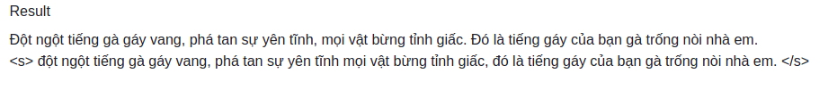
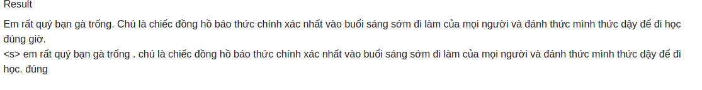
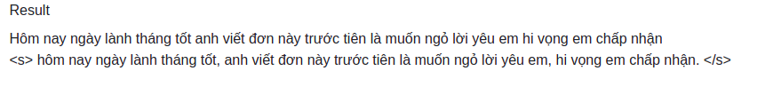

## Punctuation Restoration for Vietnamese

Our Implementation of seq2punct. Our problem is restoring missing puncts in Vietnamese sentences.
We consider this problem with [just comma and period]. 

## Framework in project 
* Python3
* Pytorch
* Flask
* Matplotlib 


## Result







## Dataset format 

Input: Seq of words

Output: Seq of punct

Ex: Text "Một đêm nọ tôi nằm mơ thấy em "  has the label: " 0  1  0  0  0  0  0  2" with [0, 1, 2] denotes space, comma, period respectively. 

You can download preprocessed data in: https://drive.google.com/drive/u/2/folders/1NfpLGRQAJPlURQa-3G6RFR2cKd1KKavt?fbclid=IwAR1-JV8NOTNGcbVtj7BkUbtNTAixxhisg4y1-qqeeOjzZAwaGcUlzAk3jtg

## For using  
* Clone this repo
* Pip install requirements
* Create dumps/ folder for saving model checkpoint
* You can download pretrained model in:  https://drive.google.com/drive/folders/1pKeP6YGsYveJNiAhl9O8vdG_OAoIx1Gk?usp=sharing
  
## Train

To train by yourselft
```
python main.py --model [RNN] --n_layers [2] -- embedding_size [256] --hidden_dim [256]

```

## Inference 


To infere: Change the path to pretrained model and run command 

```
from infere import pipeline

text = 'Tôi là Hoàng tôi là sinh viên trường Bách Khoa'

res = pipeline(text)

```


## Inference with bert 
We use pretrained phobert to extract the features of text, then add RNN and MLP to classify punct. The result ~ 95% accuracy


Train with training_bert.ipynb
Infere with infere_bert.py


## Run demo with flask
```
python app.py
```

